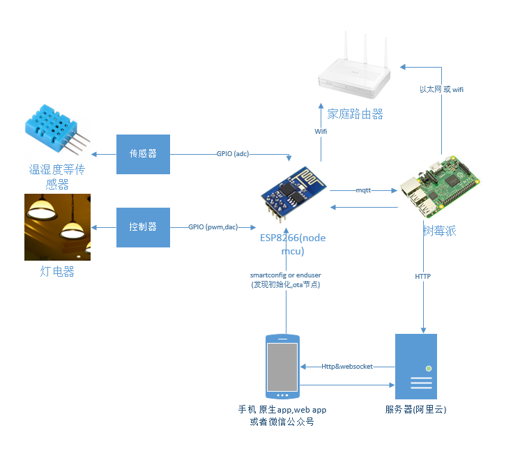

# smart-home2

- 相关技术和设备

    - esp8266 & nodemcu
    - mqtt
    - nodejs http server
    - websocket
    - raspberry pi 3b
    
- 架构

    
    

    
- [更多相关说明](http://note.youdao.com/noteshare?id=6d883798accd2661c33b77762e605d30)